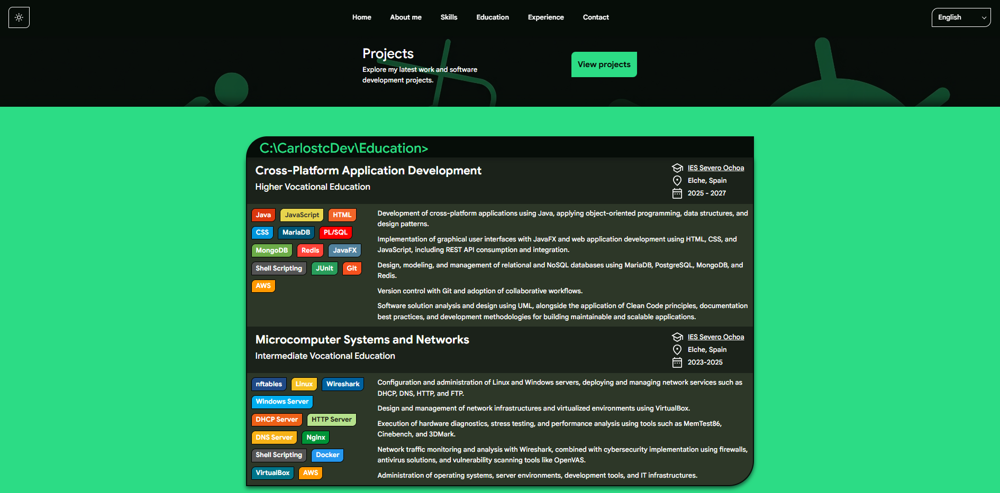
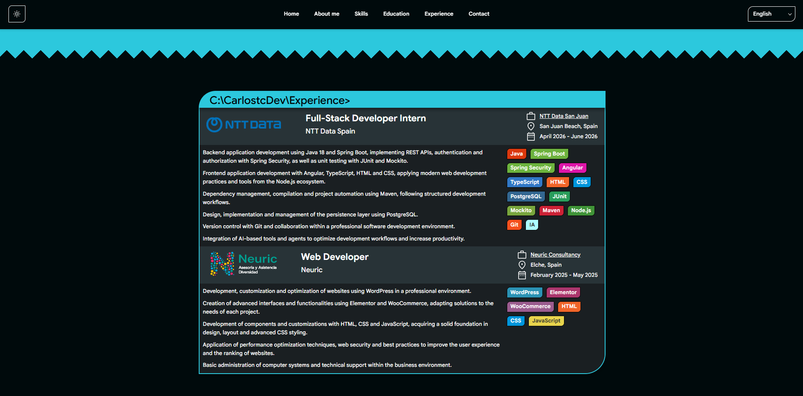

# Carlos Tormo - Portfolio

Personal portfolio website developed from scratch to showcase my projects, technical skills, education and professional experience.

## Live Demo

[Visit my portfolio](https://carlostcdev.github.io/)

## Preview




## About

This project is a modular personal portfolio built with native web technologies, without using frontend frameworks.

The website is designed to provide a maintainable and scalable structure while showcasing my development projects and professional background.

## Features

* Responsive design for desktop, tablet and mobile
* Dark and light themes
* Multiple color schemes
* Internationalization with 10 supported languages
* Automatic browser language detection
* Persistent language and theme preferences
* Dynamic component loading
* GitHub REST API integration
* Automatic project discovery through GitHub topics
* Interactive project showcase
* Interactive Lottie animation
* Localized CVs
* Clipboard functionality
* Dynamic local time display
* Modular CSS architecture

## Technologies

* HTML5
* CSS3
* JavaScript
* Node.js
* Git
* GitHub REST API
* GitHub Pages
* Lottie

The project uses vanilla JavaScript and does not depend on frontend frameworks such as React, Angular or Vue.

## Architecture

The portfolio follows a modular component-based architecture. Each component is organized into separate HTML, CSS and JavaScript files.

Components are declared in HTML using `data-component` attributes. A custom component loader resolves the corresponding HTML and JavaScript files, injects the HTML into the DOM and dynamically imports the component's JavaScript module.

Component styles are managed separately through the main stylesheet and are not loaded by the component loader.

```text
HTML
 ├── data-component
 ▼
Component Loader
 ├── Component HTML
 └── Component JavaScript
 ▼
Rendered Component

Styles
 ▼
Main Stylesheet
 └── Component CSS
```

This structure keeps individual components isolated while allowing shared components and styles to be reused across different pages.

## Project Structure

```text
.
├── components/
│   ├── sections/
│   │   ├── about-me/
│   │   ├── education/
│   │   ├── experience/
│   │   ├── home/
│   │   └── projects/
│   │
│   └── shared/
│       ├── footer/
│       ├── header/
│       └── navigator/
│
├── data/
│   ├── config.json
│   └── translates/
│
├── projects/
│   └── components/
│
├── scripts/
│   ├── animations/
│   ├── features/
│   └── utils/
│
├── sources/
│   ├── backgrounds/
│   ├── fonts/
│   ├── logos/
│   ├── profile/
│   └── svgs/
│
├── styles/
│   ├── themes/
│   └── utils/
│
├── index.html
└── LICENSE.txt
```

### Main directories

| Directory     | Purpose                                               |
| ------------- | ----------------------------------------------------- |
| `components/` | Reusable UI components and portfolio sections         |
| `data/`       | Configuration and localization data                   |
| `projects/`   | Components specific to the projects page              |
| `scripts/`    | Application logic, utilities, features and animations |
| `sources/`    | Images, fonts, logos and other static resources       |
| `styles/`     | Global styles, themes, fonts and responsive rules     |

## GitHub Integration

The projects section integrates with the GitHub REST API to retrieve repository information dynamically.

Repositories are automatically filtered using the `project` topic. This allows new projects to be added to the portfolio without manually modifying the project page.

```text
GitHub REST API
       ▼
User repositories
       ▼
Filter by "project" topic
       ▼
Project information
       ▼
Dynamic rendering
```

## Internationalization

The portfolio includes support for 10 languages:

* Spanish
* English
* Valencian
* French
* Italian
* German
* Portuguese
* Chinese
* Japanese
* Korean

The language system includes browser language detection and persistent user preferences with localStorage.

Translations are maintained separately from the application logic, allowing content to be updated without modifying individual components.

## Theming

The website's visual design is based on Material Design 3, with strong influences from the Android design language and its visual principles.

The website supports two global themes: Dark and Light. Each global theme includes six different color schemes, resulting in twelve possible theme combinations.

The color scheme is selected randomly, allowing each visit to have a different visual appearance while maintaining the selected global theme.

Theme colors and visual properties are managed through CSS custom properties, allowing the themes to be centrally configured and consistently applied throughout the website.

User preferences for the global theme are persisted locally so the selected Dark or Light mode is maintained between visits.

## Interactive Projects Page

The projects page includes an interactive Lottie-based robot animation.

The animation is integrated with the application logic to provide different visual states and interactions, including cursor-based movement and dynamic animation behavior.

The page also retrieves projects dynamically from GitHub and generates the project cards from the returned repository data.

## Local Development

Clone the repository:

```bash
git clone https://github.com/CarlostcDev/carlostcdev.github.io.git
cd carlostcdev.github.io
```

Because the project uses ES modules and dynamically fetches component files, it should be served through a local HTTP server rather than opened directly as a local file.

```bash
python -m http.server 8000
```
```bash
npx http-server -p 8080
```

Then open:

```text
http://localhost:8000
```

## Deployment

The portfolio is deployed using GitHub Pages.

## Roadmap

* [ ] Improve responsive design across all screen sizes and devices
* [ ] Add more themes and color schemes
* [ ] Add new portfolio sections
* [ ] Improve accessibility across the website
* [ ] Add project search and filtering using the GitHub REST API
* [ ] Improve the internationalization and translation system
* [ ] Optimize JavaScript execution and dynamic component loading
* [ ] Improve website performance and loading times
* [ ] Improve project data handling and rendering
* [ ] Refine animations and interactive elements

## License

This project is licensed under the MIT License.

## Author

**Carlos Tormo Castaño**
Software Development Student

* GitHub: [@CarlostcDev](https://github.com/CarlostcDev)
* Portfolio: [carlostcdev.github.io](https://carlostcdev.github.io/)